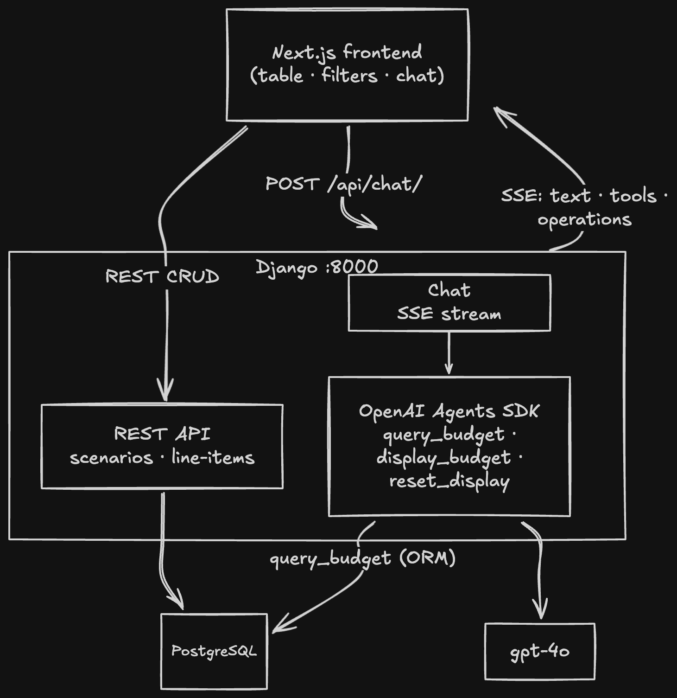
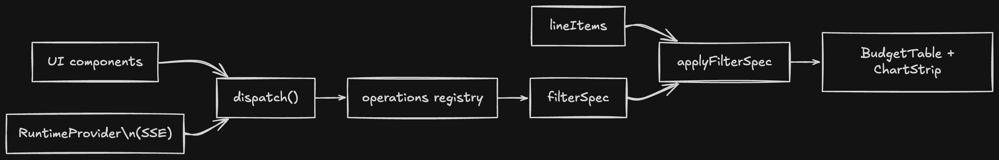
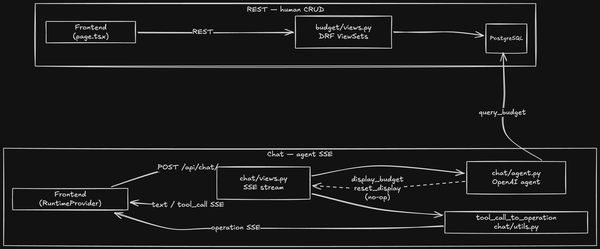
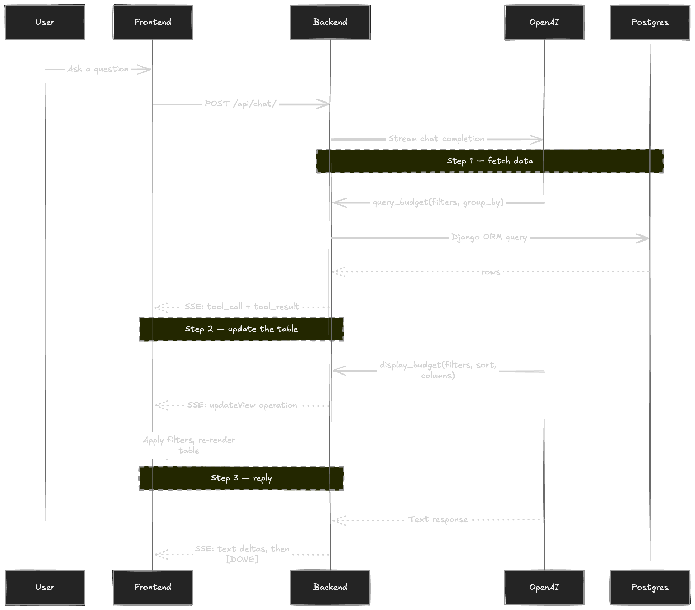

# Architecture

AI Budget Analyzer is a single-page app where a chat panel powered by an OpenAI agent controls a live budget table. The user asks questions in natural language; the agent queries the database and updates the table view in real time over SSE while it is still talking.

---

## System diagram



---

## Directory structure

```
.
├── backend/
│   ├── budget/           # REST API: models, serializers, views, URLs
│   │   └── fixtures/     # initial_data.json (demo scenario)
│   ├── chat/             # SSE chat endpoint, agent, tool_call_to_operation
│   └── budget_analyst/   # Django project settings, root URLs
├── frontend/
│   ├── app/              # Next.js app router (page.tsx, layout.tsx, RuntimeProvider.tsx)
│   ├── components/       # UI components (BudgetTable, ChartStrip, FilterBar, …)
│   │   ├── assistant-ui/ # Thread + markdown renderer
│   │   └── charts/       # Recharts wrappers (GroupedBar, TrendLine, VarianceBar)
│   └── lib/
│       ├── api.ts         # fetch wrappers
│       ├── budget.ts      # row helpers (toNum, applyFilters)
│       ├── filterSpec.ts  # FilterSpec type + applyFilterSpec
│       ├── chartData.ts   # chart data transforms
│       ├── toolRegistry.tsx  # tool-call card components
│       └── operations/    # registry.ts, useOperations.ts
├── tests/                # pytest suite (API, chat endpoint, query_budget, operations)
└── docker-compose.yml    # db · backend · frontend · test
```

---

## Data model

**BudgetScenario** — one budget plan (e.g. "FY 2026 Q1").

| Column | Type | Notes |
|--------|------|-------|
| `id` | integer | PK |
| `name` | string | |
| `period_type` | string | `year` · `half` · `quarter` · `month` |
| `description` | text | optional |
| `created_at` | datetime | auto |
| `updated_at` | datetime | auto |

**BudgetLineItem** — one row in a scenario. `scenario_id` → `BudgetScenario.id` (one-to-many).

| Column | Type | Notes |
|--------|------|-------|
| `id` | integer | PK |
| `scenario_id` | integer | FK → `BudgetScenario` |
| `period` | string | e.g. `Q1`, `Jan`, `2026` |
| `department` | string | |
| `category` | string | |
| `budget_amount` | decimal | |
| `actual_amount` | decimal | |
| `notes` | text | optional |

Variance and derived metrics (`variance_pct`, `burn_rate`, `pct_of_total`) are computed on read — in `query_budget` on the backend and in `applyFilterSpec` on the frontend. Nothing is stored.

---

## Components: Frontend



| Component | Responsibility |
|-----------|----------------|
| **`app/page.tsx`** | Root component; holds all application state (scenarios, line items, `filterSpec`). Renders the two-column layout: budget table left, chat panel right. |
| **`RuntimeProvider`** | Wraps the page in the assistant-ui runtime and wires the SSE transport to the operations dispatcher. |
| **`BudgetTable`** | Mantine data table. Renders `visibleRows` and `activeSpec`; inline editing via `useInlineEdit`. |
| **`ChartStrip`** | Three Recharts charts (grouped bar, trend line, variance bar) computed from `chartData.ts`. |
| **`Thread`** | The assistant-ui chat panel. Tool-call UI is driven by `toolRegistry.tsx`. |

---

## Components: Backend



| Component | Responsibility |
|-----------|----------------|
| **`budget/` Django app** | Standard DRF ModelViewSet for `BudgetScenario` and `BudgetLineItem`. CRUD only; no business logic. |
| **`chat/views.py`** | The SSE endpoint. Runs the agent via `Runner.run_streamed` and maps streaming events to SSE types (`tool_call`, `tool_result`, `text`, `operation`). |
| **`chat/agent.py`** | Defines the agent and its three tools: `query_budget`, `display_budget`, `reset_display` (see Core concepts). |
| **`chat/utils.py`** | `tool_call_to_operation`: translates a `display_budget`/`reset_display` tool call into an operation payload. |

### Chat request flow

The backend streams events over SSE while the agent works. In a typical turn it: (1) queries the database, (2) tells the frontend how to update the table, (3) sends a text reply.



---

## Core concepts

### `filterSpec` is the single source of truth

`filterSpec` determines what the table shows: which rows are visible, how they're grouped, what columns appear, and how they're sorted. `applyFilterSpec` applies it to the raw line items to produce `visibleRows`.

The operations registry (`frontend/lib/operations/`) is what mutates it. Operations come in two kinds:

- **`view`** — mutate `filterSpec` (setFilter, setGroupBy, setSort, addColumn, updateView, resetView…). They return a new `filterSpec` that `page.tsx` applies via `setFilterSpec`.
- **`compute`** — aggregate over `lineItems` in the browser (sum, count, min, max, pctOfBudget, pctOfTotal). Used by `FilterBar` and `ChartStrip`.

When an `operation` SSE event arrives, `RuntimeProvider` calls `dispatch`, which updates `filterSpec` and re-renders the table.

### The agent's tools

- `query_budget` — async DB query with filters, grouping, variance thresholds, and pre-computed metrics (`variance_pct`, `burn_rate`, `pct_of_total`). Returns JSON.
- `display_budget` — declares how the table should update. The SSE layer converts the call into an `operation` event that the frontend applies.
- `reset_display` — same pattern; resets the view.

---

## Design decisions and tradeoffs

### Agent declares view intent; the frontend executes it

The agent lives on the backend but the table lives in the browser. Instead of returning raw data and leaving display to the frontend, the agent calls `display_budget` to declare how the table should update — filters, grouping, sort, columns — and the frontend's operations registry executes that intent. The agent controls the answer it presents without owning any render state.

The implementation has a known wrinkle: `display_budget` has no body and returns `None`. The backend intercepts the tool *call* (not the result) in `views.py` and streams the operation event immediately, translating arguments to payload via `tool_call_to_operation` (`chat/utils.py`). A cleaner design would have the tool return the payload directly, eliminating `tool_call_to_operation`; the utility exists mainly because a pure function in its own file is trivially unit-testable. (An even earlier version was cleaner still — an `emit` callback on `AgentContext` that `views.py` injected, so `views.py` never knew which tools existed.)

### All state in `page.tsx`

Works fine at this scale. Would need a store (Zustand, Redux) as the app grows.

### No optimistic updates

Edits wait for a server round-trip and full refetch.

### Prior tool results are stubbed in message history

Before sending history back to the model, `query_budget` results are replaced with `[data fetched — will re-query]`. Keeps the context window small; the agent re-queries fresh data as needed.

### The agent cannot edit data

Write operations are intentionally human-only. Letting the agent mutate rows would require confirmation flows and rollback logic.

### No LLM abstraction layer

Swapping providers requires touching both the agent definition and the SSE stream handling in `views.py`.
