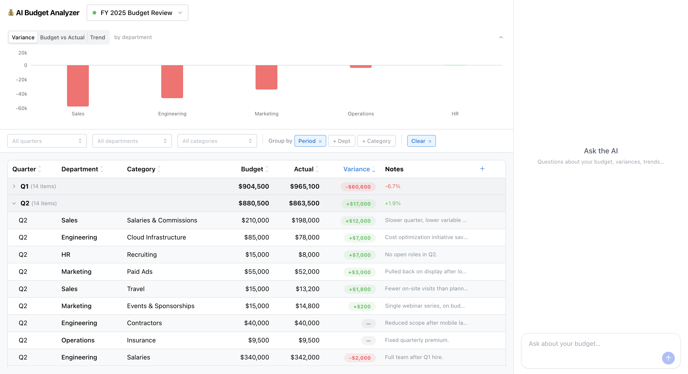

# 💰 AI Budget Analyzer

A workspace for reviewing budget scenarios with an AI assistant. You can ask questions, and the assistant will query the real data, update the table live and answer.



## Quick start

**Prerequisites:** Docker Desktop (or Docker Engine + Compose v2)

```bash
cp .env.example .env
# Set OPENAI_API_KEY in .env
docker compose up
```

Open http://localhost:3000. A demo scenario loads automatically.

> The only value you need to set in `.env` is `OPENAI_API_KEY`.

## Architecture

**Backend**: Django REST API for scenarios and line items, plus a streaming chat endpoint (SSE) that runs the AI agent.

**Frontend**: Next.js, budget table + chat panel side by side. I used existing libraries rather than building custom: [assistant-ui](https://www.assistant-ui.com/) for the chat (streaming, tool-call rendering, message history, copy/retry actions... all out of the box) and [Mantine](https://mantine.dev) for everything else (clean, data-dense, looks good without much work).

**AI**: OpenAI Agents SDK with `gpt-4o`. Handles tool schema generation, streaming events, and the run loop out of the box — raw `openai` calls would have required wiring all of that manually.

```
┌──────────────────────────────────────────────────┐
│                     Browser                      │
│                                                  │
│  ┌──────────────┐  operation    ┌──────────────┐ │
│  │ Budget Table │◀─ dispatch ───│  Chat Panel  │ │
│  │  (React)     │               │(assistant-ui)│ │
│  └──────┬───────┘               └──────┬───────┘ │
└─────────┼──────────────────────────────┼─────────┘
    REST  │                              │ POST + SSE
          │                              │
┌─────────┼──────────────────────────────┼──────────┐
│ Django  │                              │          │
│         ▼                              ▼          │
│  ┌─────────────┐          ┌──────────────────┐    │
│  │ Budget API  │          │   Chat view      │    │
│  │ (REST CRUD) │          │   (SSE stream)   │    │
│  └──────┬──────┘          └────────┬─────────┘    │
│         │                          │              │
│         │               ┌──────────▼───────────┐  │
│         │               │    Agents SDK        │  │
│         │               │  (run loop + tools)  │  │
│         │               └──────────┬───────────┘  │
│         │                          │ tool calls   │
│         ▼                          ▼              │
│  ┌────────────────────────────────────────────┐   │
│  │                  Postgres                  │   │
│  └────────────────────────────────────────────┘   │
└───────────────────────────────────────────────────┘
                           │
                           ▼ OpenAI API
                      ┌─────────┐
                      │  gpt-4o │
                      └─────────┘
```

## Trade-offs and design choices 

The key design choice is the separation between the tools `query_budget` (data access) and `display_budget` (view control). The agent never directly mutates UI state — it declares intent, and the frontend executes it through an operations registry. This keeps the agent from owning render state and makes it easy to add new table operations without touching the agent.

Trade-offs made under time constraints:

- **All state lives in `page.tsx`.** Works fine at this scale, but would need a store as the app grows.
- **No optimistic updates.** Edits wait for a server round-trip and full refetch.
- **`query_budget` results are stubbed in message history.** Prior tool results are replaced with `[data fetched — will re-query]` before being sent back to the model. Keeps the context window small; the agent re-queries fresh data as needed.
- **The agent can't edit data.** Write operations are intentionally human-only. Letting the agent mutate rows would require confirmation flows and rollback logic out of scope here.
- **Swapping the LLM provider requires touching the agent and the SSE stream handling.** There's no abstraction layer between the Agents SDK and the rest of the backend.

## Known limitations

- **Model behavior is untested.** The agent was not evaluated. Small checks were made manually using [OpenAI's agent tracing](https://openai.github.io/openai-agents-python/tracing/), but the agent still often answer questions that are off-topic, use the wrong tools, return wrong numbers, or hallucinate. 
- **All items should fit into context window.** This works well if the scenario contains few items, but when we get to hundred of items, we start eating into the context. No pagination, chunking, or pre-aggregation was implemented.
- **Non-deterministic arithmetic.** Calculations are delegated to the model. The pre-computed `variance` and `variance_pct` fields in `query_budget` reduce this risk but don't eliminate it.
- **Fixed dimensions.** Department and category are free-text strings with no controlled vocabulary. The agent uses exact-match filtering, so inconsistent casing will produce wrong results. Custom dimensions aren't supported.
- **No persistent chat.** History is in-memory only; a page refresh starts a fresh conversation.
- **Error handling in the frontend is minimal.** API errors, network timeouts, and malformed SSE events surface as a generic inline message or fail silently.
- **Dev server in Docker.** The frontend runs `next dev`, which is fine for review but not optimized for production.

## What I'd add with more time

- Persist chat turns linked to a scenario and restore them on page load.
- Improve the error handling in the frontend.
- User-defined dimensions to replace the hardcoded `department` / `category` fields, making the tool domain-agnostic.
- Cross-scenario comparison: the data model supports it but the UI and agent are scoped to one at a time.
- CSV/Excel import: without any easy way to import real data, the application is not really useful. However, the complexity (column mapping, normalizing free-text dimension values, etc.) makes the feature non-trivial.
- The agent could perform additional calculations and suggestions: forecast to completion, budget reallocation suggestions and so on.
- Other nice-to-have features include: allow exporting graphs as images and/or tables as CSV/Excel, make the agent edit the table (with confirmation steps), flag when a dimension is over budget, bookmark views (a filter/grouped table configuration), multiple currencies support with real-time conversion, budget versions/revisions (so that you can track when budget targets where changed)... the list goes on and on.
- Authentication, collaboration with multiple users with role-based access, comment/annotations on line items, audit logs, accounting tool integrations etc. would also be nice-to-have, but would require a greater amount of work.
